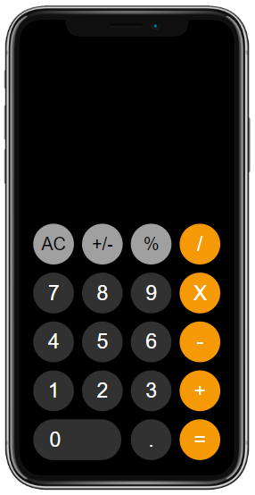

# Calculator Project

### A simple calculator created with HTML, SCSS, and JavaScript.

### It follows the Iphone calculator design but uses the Android calculator logic.

## IMPLEMENTATION

### I utilised event handlers in JavaScript to detect when a button is pressed and perform the appropriate action.

